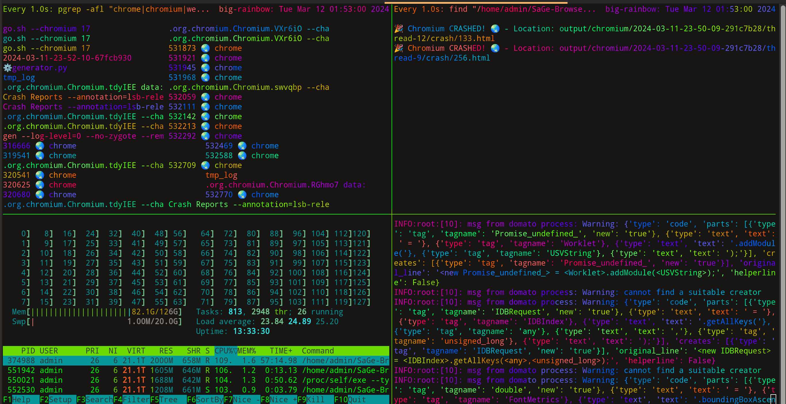

# SaGe Browser Fuzzer 🌐💻

[](https://doi.org/10.5281/zenodo.8328742)

Welcome to SaGe Browser Fuzzer, a cutting-edge tool designed for the intricate exploration of web browser semantics 🚀. Developed with a keen focus on identifying and cataloging vulnerabilities, SaGe offers a comprehensive suite of features for thorough browser testing.

## System Requirements 📋

- **Operating System**: Linux (Ubuntu 20.04 LTS and 22.04 LTS highly recommended; other distributions may function but are less tested), MacOS (experimental support), Windows (limited testing).
- **Python**: Version 3.8 or newer.
- **Selenium**: Install via `pip3 install selenium==3.141.0` and `pip3 install urllib3==1.26.5`. Newer versions may also be compatible.
- **Xvfb**: Required for headless operation on Linux, install with `apt install xvfb`.

## Installation 🛠

Ensure all dependencies are met. 

Linux users benefit from an automatic dependency check and installation feature upon initiating SaGe Launcher.

## Configuration and Usage 🖥

Set environment variables crucial for PCSG-guided fuzzing:

```shell
export COLLECT_TREE_INFO=true
export USE_INVALID_TREE=true
export PRINT_TIME=true
export INVALID_TREE_PATH="$SAGE_PATH/invalid_tree/invalid_tree.pickle"
export RULE_INFO_PATH="$SAGE_PATH/invalid_tree/global_info.pickle"
```

### Executing SaGe with `sage_launcher.sh` and sage_watcher.sh`

Utilize the `sage_launcher.sh` script for streamlined execution. 

This script encompasses dependency checks, environmental setup, and execution controls in one command. 


### Monitoring live with `sage_watcher.sh`

To monitor fuzzing in real-time, run `./sage_watcher.sh` after starting `sage_launcher.sh` in a second terminal tab/window.



#### Command-Line Options 🔍

- **Browser Selection**: Choose among `--firefox`, `--webkitgtk`, and `--chromium` for targeted fuzzing.
- **Fuzzer Choice**: Select a fuzzer through `--fuzzer` with options including `domato`, `minerva`, `freedom`, `sage`, `favocado`.
- **Clean Start**: Utilize `--kill-old` to terminate existing instances for a fresh testing environment.
- **Resource Management**: Activate the `--watchdog` for intelligent resource monitoring and management.
- **Session Timing**: Control the fuzzing duration with `--timerpurge`, specifying a numeric value for the session limit.

### Examples for Each Browser 🌍

#### Fuzzing WebKit

For users interested in WebKit, an example WebKit builder is located in the `browserbuilders` folder. Configure environment variables accordingly:

```shell
export WEBKIT_BINARY_PATH="$WEBKIT_PATH/MiniBrowser"
export WEBKIT_WEBDRIVER_PATH="$WEBKIT_PATH/WebKitWebDriver"
./sage_launcher.sh --webkitgtk 5
```

#### Fuzzing Chrome

Set up Chrome for fuzzing with the following environment variables and execute the script:

```shell
export CHROMIUM_PATH="$C_PATH/chrome"
export CHROMEDRIVER_PATH="$C_PATH/chromedriver"
./sage_launcher.sh --chromium 5
```

#### Fuzzing Firefox

Prepare Firefox for fuzzing by setting up its environment variables and start the process:

```shell
export FIREFOXDRIVER_PATH="$F_PATH/geckodriver"
export FIREFOX_PATH="$F_PATH/firefox"
./sage_launcher.sh --firefox 5
```

## Academic Contributions 🎓

Our approach and the detailed workings of SaGe are described in a publication accepted by OOPSLA 2023. For enthusiasts and researchers, a Docker environment is available for replicating our experiments, ensuring a seamless experience in understanding the tool's capabilities.

## Acknowledgements 👏

We extend our heartfelt gratitude to the Domato project, and Google for their foundational input generation techniques, which have significantly contributed to enhancing SaGe's fuzzing methodologies.
