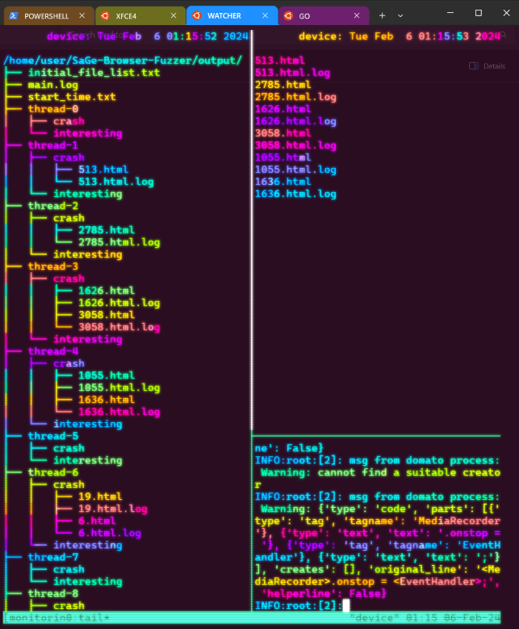

# SaGe browser fuzzer

[](https://doi.org/10.5281/zenodo.8328742)

SaGe is a browser fuzzer that can effectively explore browsers' semantics.

## Requirement

- OS: Linux (recommended, well tested in Ubuntu 20.04 LTS and 22.04 LTS); MacOS (supposed to work but not well tested); Windows (not well tested)
- Python 3.8+
- Selenium (``pip3 install selenium==3.141.0`` and ``pip3 install urllib3==1.26.5``. The versions are well tested, but the latest versions should also work.)
- Xvfb (apt install xvfb)

## Usage

Before running the tool, first set some environment variables to enable PCSG-guided fuzzing:

```shell
export COLLECT_TREE_INFO=true
export USE_INVALID_TREE=true
export PRINT_TIME=true
export INVALID_TREE_PATH="$SAGE_PATH/invalid_tree/invalid_tree.pickle"
export RULE_INFO_PATH="$SAGE_PATH/invalid_tree/global_info.pickle"
```

Next, use ```python main.py --help``` to show how it works.

```
Usage: python main [-options] -o output_dir

Options:
  -h, --help            show this help message and exit
  -f FUZZER, --fuzzer=FUZZER
                        choose a fuzzer (default: sage)
  -b BROWSER, --browser=BROWSER
                        choose a browser (default: webkitgtk)
  -t TIMEOUT, --timeout=TIMEOUT
                        timeout of each test (ms) (default: 5000ms)
  -p PARALLEL, --parallel=PARALLEL
                        how many instances in parallel (default: 1)
  -o OUTPUT_DIR, --output_dir=OUTPUT_DIR
                        where the result should output
  -e TIME_TO_EXIT, --time_to_exit=TIME_TO_EXIT
                        time to exit the fuzzing (hour)
  -x EXECUTION_ITERATION, --execution_iteration=EXECUTION_ITERATION
                        exit after this iteration
```

For each kind of browser, we need to set environment variables to specify the path of the target browser and the path of the corresponding webdriver. What follows are the commands for fuzzing WebKit, Chrome, and Firefox:

### Fuzzing WebKit

```shell
export WEBKIT_BINARY_PATH="$WEBKIT_PATH/MiniBrowser"
export WEBKIT_WEBDRIVER_PATH="$WEBKIT_PATH/WebKitWebDriver"
# max timeout for each input is 10000 ms, 10 instances are created for parallel, target browser is webkitgtk, fuzzing outputs are save in $PWD/output
python3 main.py -t 10000 -b webkitgtk -p 10 -o $PWD/output
```

### Fuzzing Chrome

```shell
export CHROMIUM_PATH="$C_PATH/chrome"
export CHROMEDRIVER_PATH="$C_PATH/chromedriver"
# max timeout for each input is 10000 ms, 10 instances are created for parallel, target browser is chrome, fuzzing outputs are save in $PWD/output
python3 main.py -t 10000 -b chromium -p 10 -o $PWD/output
```

### Fuzzing Firefox

```shell
export FIREFOXDRIVER_PATH="$F_PATH/geckodriver"
export FIREFOX_PATH="$F_PATH/firefox"
# max timeout for each input is 10000 ms, 10 instances are created for parallel, target browser is firefox, fuzzing outputs are save in $PWD/output
python3 main.py -t 10000 -b firefox -p 10 -o $PWD/output
```

### Fuzzing other browsers

This tool can adapt to any other browsers that are based on the three browsers. Generally speaking, almost all browsers are built on the top of the above three browsers. If users want to test a browser other than the three, they need to implement a subclass of ``FuzzedBrowser`` in the ``browser_adapters`` directory, and register itself in the ``get_browser()`` function of ``browser_selenium.py``.

## Implementation/Configuration Details
- If you don’t want to use Xvfb, set ``export NO_XVFB=true`` before running ``main.py``.
- During fuzzing, suppose we set p=2, this means that we create two (almost) separated browser instances, and each of them creates a new tab for handling one fuzzing input. If a browser crashes, the fuzzer will close it and create a new browser instance for testing.
- Browsers may crash because of long-term running. For stability, the fuzzer will close an instance with 1% probability. Users can use ``CLOSE_BROWSER_PROB`` to change this setting. For example, ``export CLOSE_BROWSER_PROB=0.05`` will set the probability to 5%.

## Monitor Tool Setup Instructions 

### EXTRA REQUIREMENTS 📦
- `lolcat` : Install it using the command:
  ```bash
  sudo apt install lolcat
  ```
- `tmux` : Install it using the command:
  ```bash
  sudo apt install tmux
  ```

### Setup Steps 🛠️
1. **Set Binary Path Variables** 
   - Set up the binary path for the browser and webdriver. For example:
     ```bash
     export WEBKIT_BINARY_PATH="$WEBKIT_PATH/MiniBrowser"
     export WEBKIT_WEBDRIVER_PATH="$WEBKIT_PATH/WebKitWebDriver"
     ```

2. **Run Scripts** 🚀
   - Open two terminals.
   - In the first terminal, run the `go.sh` script with the browser option:
     ```bash
     ./go.sh --webkit
     ```
   - In the second terminal, run the `watcher.sh` script:
     ```bash
     ./watcher.sh
     ```

### Monitor Setup Image Demo:
  

## Publication

The paper which describes the design detail of this browser fuzzer is accepted by OOPSLA 2023 ([doi](https://doi.org/10.1145/3622819)). BibTeX Citation is 

```bibtex
@article{zhou2023towards,
  title={Towards Better Semantics Exploration for Browser Fuzzing},
  author={Zhou, Chijin and Zhang, Quan and Guo, Lihua and Wang, Mingzhe and Jiang, Yu and Liao, Qing and Wu, Zhiyong and Li, Shanshan and Gu, Bin},
  journal={Proceedings of the ACM on Programming Languages},
  volume={7},
  number={OOPSLA2},
  pages={604--631},
  year={2023},
  publisher={ACM New York, NY, USA}
}
```

The artifact of this paper is available at [zenodo](https://doi.org/10.5281/zenodo.8328742), which includes a docker environment for reproducing the experitmental results in the paper. The artifact passed the OOPSLA'23 Artifact Evaluation and earned all badges.

## Acknowledgement

We build the fuzzer on the top of [Domato](https://github.com/googleprojectzero/domato) for input generation.
