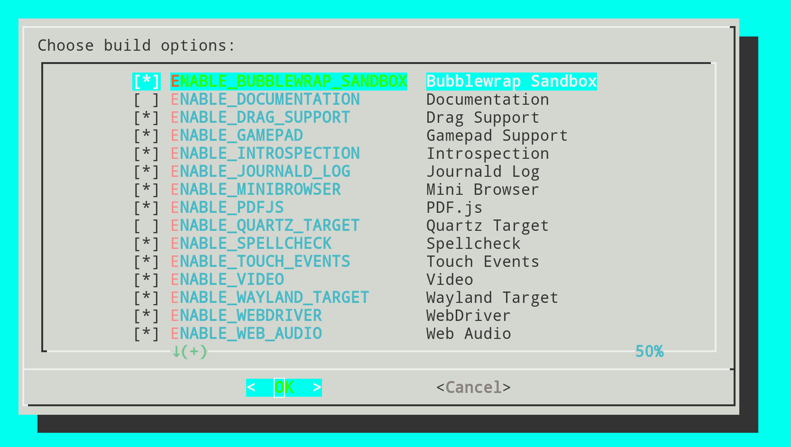

# SaGe Browser Fuzzer 🌐💻

[](https://doi.org/10.5281/zenodo.8328742)

Welcome to SaGe, a browser fuzzer designed for the intricate exploration of web browser semantics 🚀. 

Developed with a focus on identifying and cataloging internal browser JS vulnerabilities, SaGe offers an automated, comprehensive suite of features for thorough browser testing via PCSG-guided fuzzing.

## System Requirements 📋

- **Operating System**: Linux (Ubuntu 20.04 LTS and 22.04 LTS highly recommended; other distributions may function but are less tested), MacOS (experimental support), Windows (limited testing).
- **Python**: Version 3.8 or newer.
- **Selenium**: Install via `pip3 install selenium==3.141.0` and `pip3 install urllib3==1.26.5`. Newer versions may also be compatible.
- **Xvfb**: Required for headless operation on Linux, install with `apt install xvfb`.

## Installation 🛠

Ensure all dependencies are met. 

Linux users benefit from an automatic dependency check and installation feature upon initiating SaGe Launcher.

## Configuration and Usage 🖥

Set environment variables crucial for PCSG-guided fuzzing:

```shell
export COLLECT_TREE_INFO=true
export USE_INVALID_TREE=true
export PRINT_TIME=true
export INVALID_TREE_PATH="$SAGE_PATH/invalid_tree/invalid_tree.pickle"
export RULE_INFO_PATH="$SAGE_PATH/invalid_tree/global_info.pickle"
```

### Executing SaGe with `sage_launcher.sh`

Utilize the `sage_launcher.sh` script for streamlined execution. 

This script encompasses dependency checks, environmental setup, and execution controls in one command. 


### Monitoring live with `sage_watcher.sh`

To monitor fuzzing in real-time, run `./sage_watcher.sh` after starting `sage_launcher.sh` in a second terminal tab/window.


#### Command-Line Options 🔍

- **Browser Selection**: Choose among `--firefox`, `--webkitgtk`, and `--chromium` for targeted fuzzing.
- **Fuzzer Choice**: Select a fuzzer through `--fuzzer` with options including `domato`, `minerva`, `freedom`, `sage`, `favocado`.
- **Clean Start**: Utilize `--kill-old` to terminate existing instances for a fresh testing environment.
- **Resource Management**: Activate the `--watchdog` for intelligent resource monitoring and management.
- **Session Timing**: Control the fuzzing duration with `--timerpurge`, specifying a numeric value for the session limit.

### Examples for Each Browser 🌍

#### Fuzzing WebKit

For users interested in WebKit, an example WebKit builder is located in the `browserbuilders` folder. Configure environment variables accordingly:

```shell
export WEBKIT_BINARY_PATH="$WEBKIT_PATH/MiniBrowser"
export WEBKIT_WEBDRIVER_PATH="$WEBKIT_PATH/WebKitWebDriver"
./sage_launcher.sh --webkitgtk 5
```

#### Fuzzing Chrome

Set up Chrome for fuzzing with the following environment variables and execute the script:

```shell
export CHROMIUM_PATH="$C_PATH/chrome"
export CHROMEDRIVER_PATH="$C_PATH/chromedriver"
./sage_launcher.sh --chromium 5
```

#### Fuzzing Firefox

Prepare Firefox for fuzzing by setting up its environment variables and start the process:

```shell
export FIREFOXDRIVER_PATH="$F_PATH/geckodriver"
export FIREFOX_PATH="$F_PATH/firefox"
./sage_launcher.sh --firefox 5
```


## DEMO: WebKit Builder Setup 🛠️

The included WebKitGTK Builder Setup script automates the setup process for building WebKitGTK for use with SaGe, and other dependencies. 

It simplifies the process with dialog boxes for user input and displays progress in a clean and interactive manner.




### Features:

- **Interactive Dialogs**: Utilizes dialog boxes for inputs and displays like welcome message, WebKitGTK version input, and build options.
- **Dynamic Build Options**: Allows selecting various build options through a checklist dialog.
- **Package Installation**: Installs required packages automatically based on the build environment needs.
- **Dependency Management**: Clones and sets up necessary dependencies like libjxl and libbacktrace.
- **Swapfile Management**: Includes functionality to create and remove a swapfile to facilitate builds on systems with limited RAM.
- **Custom Build Commands**: Converts selected build options into commands for cmake and Ninja, facilitating a tailored build process.

### Usage:

1. **Start the Script**: Run the script with `./browser_builders/sage_getwebkit.sh.sh`.
2. **Follow Dialog Prompts**: Input the desired WebKitGTK version, select build options, and proceed through the setup as guided by the dialogs.
3. **Monitor Progress**: The script displays progress in dialog boxes for each step, including package installations and builds.
4. **Completion**: Upon successful completion, the environment will be set up with the selected configurations.

## Academic Contributions 🎓

Our approach and the detailed workings of SaGe are described in a publication accepted by OOPSLA 2023. For enthusiasts and researchers, a Docker environment is available for replicating our experiments, ensuring a seamless experience in understanding the tool's capabilities.

### Fuzzing other browsers

This tool can adapt to any other browsers that are based on the three browsers. Generally speaking, almost all browsers are built on the top of the above three browsers. If users want to test a browser other than the three, they need to implement a subclass of ``FuzzedBrowser`` in the ``browser_adapters`` directory, and register itself in the ``get_browser()`` function of ``browser_selenium.py``.

## Implementation/Configuration Details
- If you don’t want to use Xvfb, set ``export NO_XVFB=true`` before running ``go.sh``.
- During fuzzing, suppose we set p=2, this means that we create two (almost) separated browser instances, and each of them creates a new tab for handling one fuzzing input. If a browser crashes, the fuzzer will close it and create a new browser instance for testing.
- Browsers may crash because of long-term running. For stability, the fuzzer will close an instance with 1% probability. Users can use ``CLOSE_BROWSER_PROB`` to change this setting. For example, ``export CLOSE_BROWSER_PROB=0.05`` will set the probability to 5%.

## Publication

The paper which describes the design detail of this browser fuzzer is accepted by OOPSLA 2023 ([doi](https://doi.org/10.1145/3622819)). BibTeX Citation is 

```bibtex
@article{zhou2023towards,
  title={Towards Better Semantics Exploration for Browser Fuzzing},
  author={Zhou, Chijin and Zhang, Quan and Guo, Lihua and Wang, Mingzhe and Jiang, Yu and Liao, Qing and Wu, Zhiyong and Li, Shanshan and Gu, Bin},
  journal={Proceedings of the ACM on Programming Languages},
  volume={7},
  number={OOPSLA2},
  pages={604--631},
  year={2023},
  publisher={ACM New York, NY, USA}
}
```

The artifact of this paper is available at [zenodo](https://doi.org/10.5281/zenodo.8328742), which includes a docker environment for reproducing the experitmental results in the paper. The artifact passed the OOPSLA'23 Artifact Evaluation and earned all badges.

## Acknowledgements 👏

We extend our heartfelt gratitude to the Domato project, and Google for their foundational input generation techniques, which have significantly contributed to enhancing SaGe's fuzzing methodologies.
